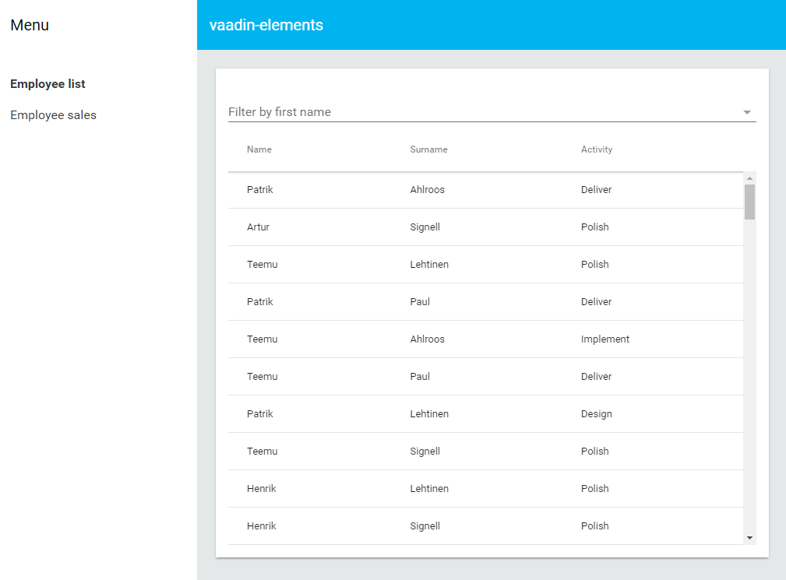

= Usage with Polymer-CLI

[[generator-polymer-init-vaadin-elements-app.overview]]
== Overview

The [elementname]#generator-polymer-init-vaadin-elements-app# is a boilerplate template for creating
a new Polymer Application which uses Paper and Vaadin Elements.

The Template, which smoothly integrates with the
link:https://github.com/Polymer/polymer-cli[Polymer-CLI] tool, produces a fully featured
PWA (Progressive Web Application) .

[[generator-polymer-init-vaadin-elements-app.installation]]
== Installation

We are assuming that you already have installed in your system `node.js`, `npm`, `bower`, and `polymer-cli` tools.
Otherwise, please follow the specific instructions of each tool in their website.

Then install the template package globally:

[subs="normal"]
----
[prompt]#$# [command]#npm# install -g generator-polymer-init-vaadin-elements-app
----

[[generator-polymer-init-vaadin-elements-app.create]]
== Creating the Application

Create a new application with the polymer init command passing the `vaadin-elements-app` argument:

[subs="normal"]
----
[prompt]#$# [command]#mkdir# [replaceable]#my-project#
[prompt]#$# [command]#cd# [replaceable]#my-project#
[prompt]#$# [command]#polymer# init vaadin-elements-app
----

It will create a Polymer-CLI project structure. In order to know more details abut the project structure,
or to check more command options in the tool, please refer to the link:https://github.com/Polymer/polymer-cli[Polymer-CLI]
documentation.

[[generator-polymer-init-vaadin-elements-app.installation]]
== Developing

The following command serves the app at http://localhost:8080, and provides a basic URL routing for the application:

[subs="normal"]
----
[prompt]#$# [command]#polymer# serve
----

Now, you can modify application files with your favorite editor, and those changes will be
automatically reloaded in the browser.

[[figure.vaadin-combo-box.overview]]
.A screenshot of the generated application

[[generator-polymer-init-vaadin-elements-app.test]]
== Testing

The application includes automated tests located in the [filename]#test# directory. To run the tests,
run the following command:

[subs="normal"]
----
[prompt]#$# [command]#polymer# test
----

[[generator-polymer-init-vaadin-elements-app.build]]
== Building

The following command performs HTML, CSS, and JS minimization of the dependencies,
and generates the service workers.

[subs="normal"]
----
[prompt]#$# [command]#polymer# build
----

It outputs two versions of the website, one in the
[filename]#build/bundled# folder for HTTP/2+Push compatible servers, and the other
output in the [filename]#build/bundled# folder that bundles all the dependencies in a single file,
it is compatible with any classic web server.

If you have installed the link:https://www.npmjs.com/package/serve[serve] http-server in your system,
you can test the build by running the following command.

[subs="normal"]
----
[prompt]#$# [command]#polymer# serve build/bundled
----
